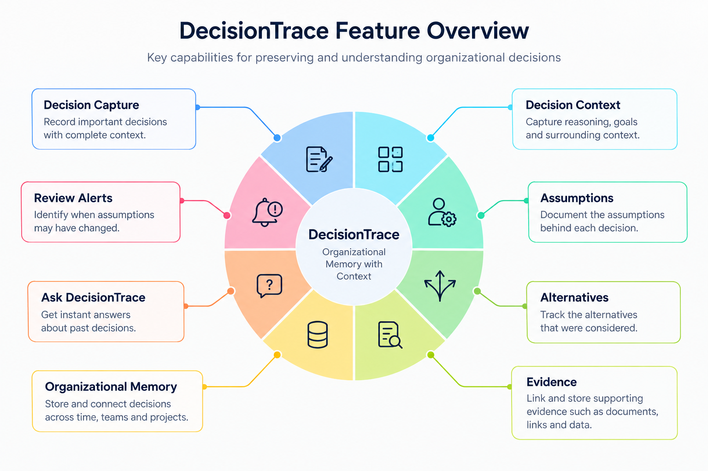
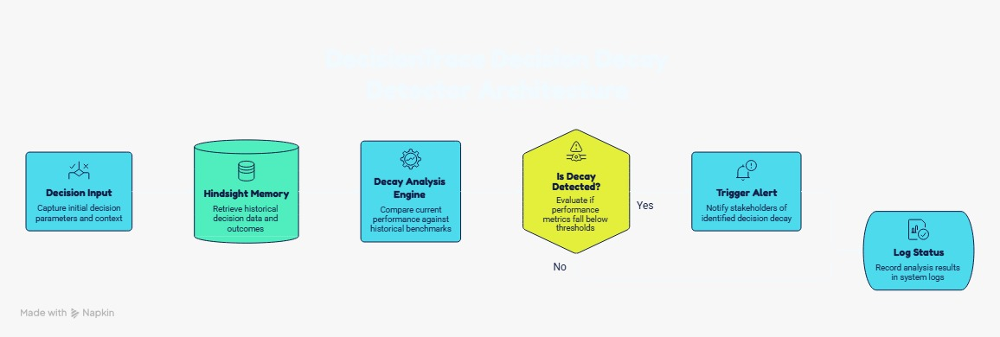
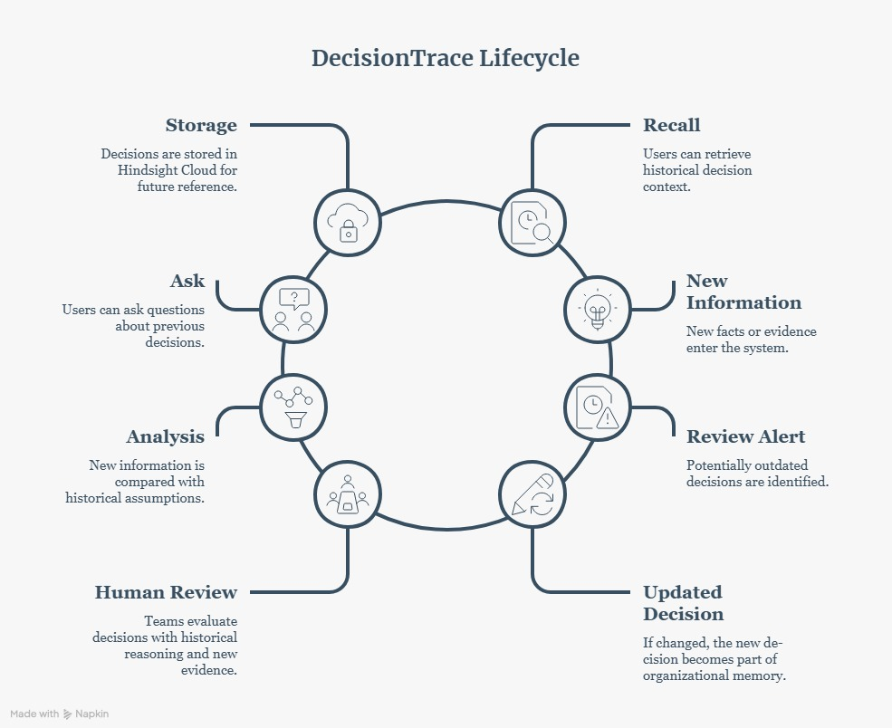
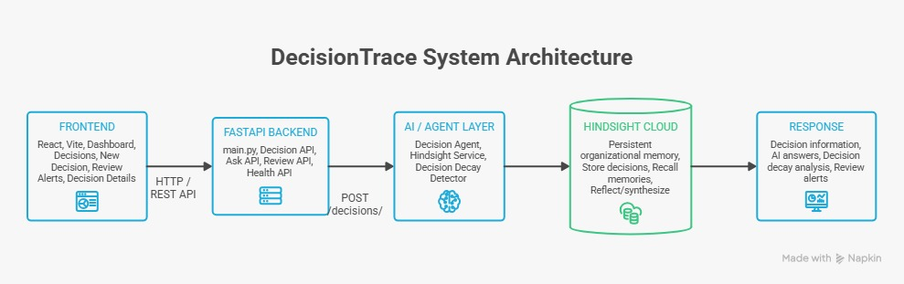

# 🧠 DecisionTrace

<p align="center">
  <strong>Your team remembers WHAT it decided.<br/>
  DecisionTrace remembers WHY.</strong>
</p>

<p align="center">
  An AI-powered organizational memory agent that preserves the reasoning behind decisions and surfaces when the assumptions behind them may have changed.
</p>

<p align="center">
  <strong>🏆 Built for Hack with Hyd — Microsoft Hackathon</strong>
</p>

---

## 🧩 The Problem in One Story

Imagine your team made an important decision six months ago.

Everyone remembers:

> **"We chose PostgreSQL."**

But then someone asks:

> **"Why?"**

Suddenly, the answers are scattered.

Someone remembers the scalability discussion.

Someone remembers analytics requirements.

Someone remembers cost.

Someone remembers a different alternative that was considered.

The original reasoning is buried somewhere in meetings, chats, documents, and project discussions.

Now the team has new information.

The question becomes even more important:

> **"Are the reasons behind that decision still true?"**

### That's where DecisionTrace comes in.

DecisionTrace doesn't just remember the final answer.

It preserves the **story behind the answer**.

---

# 🎯 The Problem

Modern teams create decisions across many different sources:

- 💬 Team conversations
- 📝 Meeting discussions
- 📄 Documents
- 📧 Emails
- 📊 Project discussions
- 🔗 Supporting evidence

But organizational memory becomes fragmented.

Teams can usually answer:

> **"What did we decide?"**

The harder question is:

> **"Why did we decide that?"**

And the question that often gets missed:

> **"What assumptions were we relying on?"**

Even more importantly:

> **"Have those assumptions changed?"**

When this context is lost, teams may:

- Repeat old discussions
- Reconstruct reasoning from scratch
- Lose track of alternatives
- Forget supporting evidence
- Continue relying on assumptions that may no longer hold

---

# 💡 Our Solution

## DecisionTrace — Organizational Memory With Context

DecisionTrace treats a decision as more than a final answer.

Each decision can carry its surrounding context:

```text
                         ┌─────────────────┐
                         │    DECISION     │
                         └────────┬────────┘
                                  │
             ┌────────────────────┼────────────────────┐
             │                    │                    │
             ▼                    ▼                    ▼
         WHY?                ASSUMPTIONS          ALTERNATIVES
             │                    │                    │
             └────────────────────┼────────────────────┘
                                  │
             ┌────────────────────┼────────────────────┐
             │                    │                    │
             ▼                    ▼                    ▼
         EVIDENCE            STAKEHOLDERS          OUTCOMES
```

Instead of storing only:

```text
"We chose PostgreSQL."
```

DecisionTrace aims to preserve:

```text
WHAT
  +
WHY
  +
ASSUMPTIONS
  +
ALTERNATIVES
  +
EVIDENCE
  +
STAKEHOLDERS
  +
OUTCOMES
```

That context becomes the foundation of organizational memory.

---

# 🗺️ DecisionTrace at a Glance

DecisionTrace brings decision capture, organizational memory, evidence, questioning, and review intelligence together in one workspace.

<p align="center">
  
</p>

<p align="center">
  <em>DecisionTrace connects decisions, reasoning, assumptions, evidence, and review intelligence in one workspace.</em>
</p>

---

# 🚨 Our Core Idea: Decision Decay

A decision can remain stored long after the assumptions behind it have changed.

Consider:

```text
ORIGINAL DECISION
        │
        ▼
"We chose PostgreSQL because
we expect heavy analytics workloads."
        │
        │
        ▼
NEW INFORMATION
        │
        ▼
"Analytics requirements have
decreased significantly."
        │
        ▼
⚠️ POTENTIAL DECISION DECAY
        │
        ▼
HUMAN REVIEW
```

The original decision isn't automatically changed.

Instead, DecisionTrace surfaces a signal:

> **"Something that influenced this decision may have changed."**

This gives the team an opportunity to review the decision with its original context still available.

### The principle

> **AI surfaces the signal. Humans make the decision.**

---

# 🔄 How Decision Decay Works

<p align="center">
  
</p>

<p align="center">
  <em>New information is compared with the assumptions and reasoning associated with previous decisions.</em>
</p>

The workflow is:

```text
New Information
       │
       ▼
Understand the information
       │
       ▼
Compare with decision context
       │
       ▼
Check relevant assumptions
       │
       ▼
Potential conflict/change?
       │
   ┌───┴───┐
   │       │
  YES      NO
   │       │
   ▼       ▼
Review    Continue
Alert     Monitoring
   │
   ▼
Human Review
```

The goal is not to automatically rewrite history.

The goal is to make potentially outdated reasoning **visible**.

---

# 🧠 How DecisionTrace Works

A decision moves through a traceable lifecycle:

```text
CAPTURE
   ↓
UNDERSTAND
   ↓
STORE CONTEXT
   ↓
CONNECT EVIDENCE
   ↓
ASK QUESTIONS
   ↓
CHECK ASSUMPTIONS
   ↓
SURFACE REVIEW SIGNALS
   ↓
HUMAN REVIEW
```

Each stage adds context to the decision rather than treating it as an isolated record.

---

# 🔁 DecisionTrace Lifecycle

<p align="center">
  
</p>

<p align="center">
  <em>From capturing a decision to preserving its context and surfacing potential changes for human review.</em>
</p>

This makes it possible to revisit a decision with its original reasoning instead of reconstructing everything from scattered sources.

---

# 🏗️ System Architecture

DecisionTrace is organized as a modular system.

The frontend provides the decision workspace, the backend exposes application APIs and processing logic, and Hindsight serves as the persistent memory layer.

<p align="center">
  
</p>

<p align="center">
  <em>High-level architecture connecting the DecisionTrace interface, backend services, AI reasoning, and persistent organizational memory.</em>
</p>

### Core Layers

| Layer | Responsibility |
|---|---|
| 🖥️ Frontend | Dashboard, decisions, projects, review alerts, settings and decision details |
| ⚙️ Backend | API endpoints and application logic |
| 🧠 Hindsight | Persistent memory layer for organizational context |
| 📊 Decision Layer | Decisions, reasoning, assumptions, alternatives and evidence |
| 🔎 Review Layer | New-information analysis and potential decision decay |

---

# ✨ What Can You Do With DecisionTrace?

## 📌 1. Capture Decisions

Create a structured record of an important decision.

A decision can include:

- Decision title
- Description
- Reasoning
- Assumptions
- Alternatives
- Evidence
- Stakeholders
- Project
- Status
- Date

---

## 🔎 2. Ask DecisionTrace

Instead of manually searching through old discussions, ask a question.

For example:

> **"Why did we choose PostgreSQL?"**

DecisionTrace can use the available decision context to provide an answer.

### API

```http
POST /ask/
```

### Request

```json
{
  "question": "Why did we choose PostgreSQL?"
}
```

### Response

```json
{
  "answer": "..."
}
```

---

## 🚨 3. Review New Information

New information can be submitted for analysis against existing decision context.

### API

```http
POST /review/
```

### Request

```json
{
  "new_information": "Analytics requirements have decreased significantly."
}
```

### Response

```json
{
  "analysis": "..."
}
```

This creates a pathway for identifying decisions that may deserve human review.

---

## 🕒 4. Decision Timeline

A decision isn't just a final state.

Its context develops over time.

DecisionTrace represents that history through events such as:

```text
Decision Created
      ↓
Reason Recorded
      ↓
Assumptions Added
      ↓
Alternatives Considered
      ↓
Evidence Added
      ↓
Potential Change Detected
      ↓
Human Review
```

This makes the evolution of a decision easier to understand.

---

## 📚 5. Evidence & Context

Decisions can retain supporting evidence and contextual information so teams can understand not only:

> **What was decided?**

but also:

> **What information influenced the decision?**

---

## 👥 6. Stakeholder Context

Important decisions can retain information about the people involved in the decision-making process.

This helps preserve the human context surrounding important decisions.

---

# 💬 Ask DecisionTrace

The question interface is designed around a simple idea:

> **Don't search through everything. Ask about the decision.**

Example questions:

```text
"Why did we choose PostgreSQL?"

"What assumptions were made?"

"What alternatives did we consider?"

"What evidence supported this decision?"
```

The objective is to turn organizational memory into something that can be **queried conversationally**.

---

# 🚨 Review Alerts

The Review Alerts interface provides a dedicated space for decisions that may require attention.

Instead of silently changing an existing decision, the system can surface a review signal when new information may conflict with the context behind it.

```text
Existing Decision
       +
New Information
       │
       ▼
Potential Change
       │
       ▼
🚨 Review Alert
       │
       ▼
Human Evaluation
```

This keeps humans in control of the final decision.

---

# 🖥️ Product Experience

DecisionTrace is designed as a focused workspace for exploring organizational memory.

### Core screens

| Screen | Purpose |
|---|---|
| 📊 Dashboard | Overview of decisions and projects |
| 📌 Decisions | Browse and search decisions |
| 🧠 Decision Details | Explore reasoning and context |
| 🔎 Ask DecisionTrace | Ask questions about decisions |
| 🚨 Review Alerts | Review potential decision decay |
| 📁 Projects | Organize decisions by project |
| 🕒 Timeline | Understand decision history |
| ⚙️ Settings | Manage application preferences |
| 👤 Profile | User information and account actions |

### Interface capabilities

- 🌙 Dark / light appearance
- 🔎 Decision and project search
- 📌 Decision creation
- 📊 Dashboard overview
- 🚨 Review alerts
- 🕒 Decision timeline
- 📚 Evidence display
- 👥 Stakeholder context

---

# 🔐 Human-in-the-Loop

DecisionTrace is designed to **support human decision-making, not replace it**.

The system can:

```text
REMEMBER
   ↓
CONNECT
   ↓
ANALYZE
   ↓
SURFACE A SIGNAL
```

But the final decision remains with people:

```text
AI

"This assumption may have changed."

          ↓

HUMAN

"Should we revisit this decision?"
```

This is especially important for organizational decisions where context, trade-offs, and human judgment matter.

---

# 🧰 Technology Stack

### Frontend

- React
- Vite
- JavaScript
- CSS
- React Router

### Backend

- Python
- FastAPI

### AI / Memory

- Hindsight
- AI-assisted decision analysis

### Development

- Git
- GitHub
- VS Code

---

# 🔌 API Overview

| Endpoint | Method | Purpose |
|---|---|---|
| `/ask/` | `POST` | Ask questions about organizational decisions |
| `/review/` | `POST` | Analyze new information against decision context |

### Ask Flow

```text
User Question
      │
      ▼
   /ask/
      │
      ▼
DecisionTrace Memory
      │
      ▼
Relevant Context
      │
      ▼
    Answer
```

### Review Flow

```text
New Information
      │
      ▼
  /review/
      │
      ▼
Decision Context
      │
      ▼
Analysis
      │
      ▼
Potential Review
```

---

# 📂 Project Structure

```text
DecisionTrace/
│
├── ai/
│   └── AI and reasoning components
│
├── backend/
│   └── FastAPI backend
│
├── database/
│   └── Database / persistence components
│
├── frontend/
│   ├── src/
│   ├── public/
│   ├── package.json
│   └── vite.config.js
│
├── docs/
│   ├── architecture.png
│   ├── decision-decay.png
│   ├── feature-overview.png
│   └── lifecycle.png
│
└── README.md
```

---

# 🚀 Running the Frontend

### 1. Clone the repository

```bash
git clone <repository-url>
cd DecisionTrace
```

### 2. Navigate to the frontend

```bash
cd frontend
```

### 3. Install dependencies

```bash
npm install
```

### 4. Start the development server

```bash
npm run dev
```

### 5. Build for production

```bash
npm run build
```

---

# 🧪 Example: Decision Decay in Action

### Original Decision

**Use PostgreSQL for the analytics platform.**

### Why?

The team expected significant analytical workloads.

### Assumption

Analytics requirements would remain high.

### Alternative

MongoDB was considered.

### New Information

Analytics requirements later decreased.

### DecisionTrace Signal

```text
⚠️ POTENTIAL DECISION DECAY

The assumption supporting the
original decision may have changed.

→ Review recommended
```

The original decision remains intact.

The team can now decide whether the changed assumption is significant enough to revisit it.

---

# 🌱 Why This Matters

Organizations don't just accumulate information.

They accumulate **decisions**.

And every important decision has a story:

```text
Decision
   +
Reason
   +
Assumptions
   +
Alternatives
   +
Evidence
   +
People
   +
Outcome
```

Losing that story means losing part of the organization's memory.

DecisionTrace is designed to preserve it.

---

# 🏆 What Makes DecisionTrace Different?

Traditional knowledge systems primarily focus on finding information.

DecisionTrace focuses on **remembering organizational decisions with their context**.

### Traditional approach

```text
"What happened?"
       ↓
Find the document
       ↓
Read the discussion
       ↓
Reconstruct the reasoning
```

### DecisionTrace approach

```text
"What happened?"
       +
"Why?"
       +
"What assumptions?"
       +
"What evidence?"
       +
"Did anything change?"
       ↓
Decision Context
       ↓
Review when needed
```

The key idea is simple:

> **Don't just preserve the decision. Preserve the reasoning that made the decision meaningful.**

---

# 🔮 Future Possibilities

DecisionTrace can evolve into a broader organizational decision intelligence platform.

Potential extensions include:

- 📧 Email and communication ingestion
- 💬 Meeting and chat integration
- 📄 Automatic decision extraction from documents
- 🔗 Evidence graph visualization
- 📈 Decision outcome tracking
- 🔔 Continuous assumption monitoring
- 🧩 Collaboration-tool integrations
- 📊 Organizational decision analytics
- 🤖 More advanced decision-support capabilities

---

# 👥 Team

<p align="center">

### Built with ❤️ for Hack with Hyd — Microsoft Hackathon

**DecisionTrace Team**

</p>

---

# 💭 The Idea in One Sentence

<p align="center">
  <strong>Most systems remember the answer.</strong>
  <br/>
  <strong>DecisionTrace remembers the story.</strong>
</p>

<p align="center">
  Because knowing <strong>what happened</strong> is useful.<br/>
  Knowing <strong>why it happened</strong> is powerful.
</p>

---